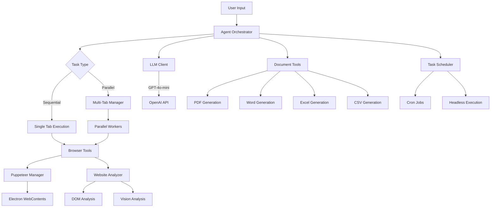
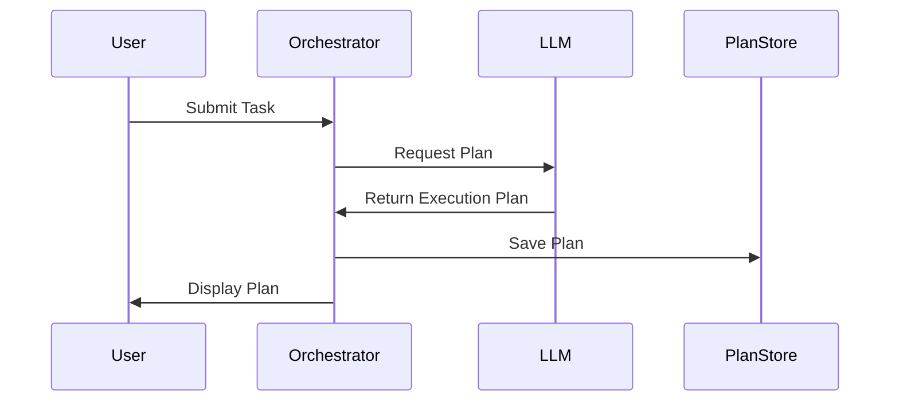
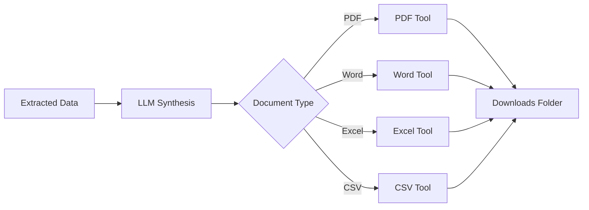

# 🫐 Blueberry Browser

> An autonomous AI-powered browser that executes complex tasks, generates documents, and automates web workflows using GPT-4o-mini.

## 🎥 Demo Video

https://github.com/user-attachments/assets/agentbrowser_headless_task.mp4

> **Note**: The demo video shows the headless task scheduler executing automated cryptocurrency data collection. If the video doesn't play above, you can [download it directly](./videos/agentbrowser_headless_task.mov).

---

## 📋 Table of Contents

- [Overview](#overview)
- [System Architecture](#system-architecture)
- [Key Features](#key-features)
- [How It Works](#how-it-works)
- [Installation](#installation)
- [Usage Examples](#usage-examples)
- [Scheduled Tasks](#scheduled-tasks)
- [Document Generation](#document-generation)
- [Contributing](#contributing)

---

## 🎯 Overview

Blueberry Browser is an intelligent autonomous browser that combines the power of:
- **Electron** - Cross-platform desktop application
- **Puppeteer** - Browser automation and control
- **LangChain** - AI agent orchestration
- **OpenAI GPT-4o-mini** - Natural language understanding and task execution

The system can understand natural language requests, break them down into actionable steps, execute them across multiple browser tabs in parallel, and generate professional documents (PDF, Word, Excel, CSV) from the results.

---

## 🏗️ System Architecture



---

## ✨ Key Features

### 🤖 Autonomous Task Execution
- **Natural Language Processing**: Understands complex user requests
- **Intelligent Planning**: Breaks down tasks into executable steps
- **Adaptive Execution**: Handles errors and retries automatically
- **Loop Detection**: Prevents infinite loops with smart thresholds

### 🚀 Parallel Execution
- **Multi-Tab Management**: Executes sub-tasks simultaneously
- **Worker Orchestration**: Manages multiple autonomous agents
- **Result Synthesis**: Combines outputs from parallel workers
- **Resource Optimization**: Efficiently manages browser resources

### 📄 Document Generation
- **PDF Reports**: Professional formatted PDF documents
- **Word Documents**: .docx files with headings and tables
- **Excel Spreadsheets**: Structured data with styling
- **CSV Files**: Comma-separated values for data export

### ⏰ Task Scheduling
- **Cron-based Scheduling**: Run tasks at specific intervals
- **Headless Execution**: Background task processing
- **Persistent Storage**: Tasks survive app restarts
- **Real-time Monitoring**: Track scheduled task execution

### 🛠️ Browser Automation
- **Navigation**: Visit websites and handle redirects
- **Element Interaction**: Click, type, scroll intelligently
- **Content Extraction**: Smart content analysis with AI
- **Form Handling**: Fill forms and submit data
- **Screenshot Capture**: Visual documentation

---

## 🔄 How It Works

### 1. Task Reception

```
User Input → Agent Orchestrator → Task Classification
```

The system receives a natural language request and classifies it as either:
- **Sequential**: Single-tab linear execution
- **Parallel**: Multi-tab concurrent execution

### 2. Planning Phase



The AI creates a structured plan with:
- Clear goals
- Step-by-step actions
- Dependencies between steps
- Success criteria

### 3. Execution Phase

**Sequential Execution:**
```
Step 1 → Step 2 → Step 3 → Result
```

**Parallel Execution:**
```
         → Worker 1 (Tab 1) →
Main →  → Worker 2 (Tab 2) →  → Synthesis → Result
         → Worker 3 (Tab 3) →
```

### 4. Document Generation



### 5. Result Delivery

The system provides:
- **Structured Output**: Formatted results
- **File Artifacts**: Generated documents
- **Execution Summary**: What was accomplished
- **Next Steps**: Suggestions for follow-up actions

---

## 📦 Installation

### Prerequisites

- Node.js 18+ 
- pnpm
- OpenAI API Key

### Setup

```bash
# Clone the repository
git clone <your-repo-url>
cd blueberry-browser

# Install dependencies
pnpm install

# Create .env file
cp .env.example .env

# Add your API keys to .env
OPENAI_API_KEY=your_openai_api_key_here
LLM_MODEL=gpt-4o-mini
LLM_PROVIDER=openai

# Start development server
pnpm dev
```

---

## 🎬 Usage Examples

### Example 1: Research and Report Generation

**Prompt:**
```
Research how AI is changing healthcare, finance, and education. Create a 10,000-word PDF report with comprehensive analysis, case studies, and future predictions.
```

**Execution:**
1. Agent creates plan with 8 research tasks
2. Spawns parallel workers for each sector
3. Workers visit multiple authoritative websites
4. Extracts detailed information and data
5. Synthesizes comprehensive report
6. Generates professional PDF document

**Output:**
- `report_2025-11-22_19-45-30.pdf` in Downloads folder
- 10,000+ words with multiple sections
- Properly formatted with headings and structure

### Example 2: Data Collection

**Prompt:**
```
Visit coinmarketcap.com and copy the top 10 crypto prices. Create CSV file with columns: Rank, Name, Symbol, Price, Change_24h. Repeat each coin 100 times to make 1000 rows.
```

**Execution:**
1. Navigate to website
2. Extract top 10 cryptocurrency data
3. Duplicate data to reach 1000 rows
4. Generate CSV file with proper formatting

**Output:**
- `crypto_data_2025-11-22_20-31-40.csv`
- 1000 rows of structured data
- Properly formatted CSV

### Example 3: Parallel Web Research

**Prompt:**
```
Research the top 5 programming languages. For each language, find: popularity ranking, use cases, salary data, and job market trends. Create Excel spreadsheet with all data.
```

**Execution:**
1. Creates 5 parallel workers (one per language)
2. Each worker researches independently
3. Collects data from multiple sources
4. Synthesizes all results
5. Generates structured Excel file

---

## ⏰ Scheduled Tasks

### Creating a Scheduled Task

Navigate to the Task Scheduler interface and create a new task:

**Task Configuration:**
```json
{
  "name": "Daily Crypto Tracker",
  "prompt": "Visit coinmarketcap.com and extract top 100 crypto prices. Create Excel file with timestamped data.",
  "schedule": "0 9 * * *",  // Every day at 9 AM
  "enabled": true
}
```

**Cron Expression Examples:**

| Expression | Description |
|------------|-------------|
| `*/2 * * * *` | Every 2 minutes |
| `0 * * * *` | Every hour |
| `0 9 * * *` | Every day at 9 AM |
| `0 9 * * 1` | Every Monday at 9 AM |
| `0 0 1 * *` | First day of every month |

### Monitoring Scheduled Tasks

- ✅ View task execution history
- 📊 Track success/failure rates
- 🔔 Receive notifications on completion
- 📁 Access generated files in Downloads

---

## 📄 Document Generation

### PDF Documents

```typescript
{
  title: "Report Title",
  sections: [
    {
      heading: "Introduction",
      paragraphs: [
        "Detailed paragraph content...",
        "Additional analysis..."
      ]
    }
  ]
}
```

### Excel Spreadsheets

```typescript
{
  data: [
    { name: "Bitcoin", price: "$98,234", change: "+2.3%" },
    { name: "Ethereum", price: "$3,567", change: "-1.2%" }
  ],
  sheetName: "Crypto Data"
}
```

### CSV Files

```csv
Rank,Name,Symbol,Price,Change_24h
1,Bitcoin,BTC,$98234.56,+2.3%
2,Ethereum,ETH,$3567.89,-1.2%
```

---

## 🔧 Configuration

### Model Settings

Edit `src/main/agent/constants.ts`:

```typescript
export const MODELS = {
  MAIN: 'gpt-4o-mini',      // Primary model for tasks
  FAST: 'gpt-4o-mini',      // Fast model for quick operations
  VISION: 'gpt-4o'          // Vision model for image analysis
};
```

### Loop Detection

```typescript
export const LOOP_DETECTION = {
  DEFAULT_THRESHOLD: 6,
  PARALLEL_TOOL_THRESHOLD: 15,
  PARALLEL_TOOLS: ['create_new_tab', 'extract_smart_content', 'navigate'],
  PATTERN_CHECK_LENGTH: 10
};
```

### Retry Limits

```typescript
export const RETRY_LIMITS = {
  MAX_NAVIGATION_RETRIES: 3,
  MAX_CLICK_RETRIES: 3,
  MAX_AGENT_ITERATIONS: 60,
  STALE_CONNECTION_RETRIES: 3
};
```

---

## 🎥 Demo Video

### Full Demo: Headless Task Scheduler

The video demonstrates the autonomous task scheduler executing a cryptocurrency data collection task in headless mode:

**Watch the demo:** [agentbrowser_headless_task.mov](./videos/agentbrowser_headless_task.mov)

**What's shown in the video:**
- ⏰ Scheduled task initialization
- 🤖 Autonomous agent planning and execution
- 🌐 Multi-website navigation and data extraction
- 📊 Automatic CSV/Excel file generation
- ✅ Task completion and file delivery

**To upload your own demo:**
1. Upload video to YouTube, Vimeo, or Loom
2. Update the GitHub link in the README header
3. Video will auto-play on GitHub README page

---

## 🤝 Contributing

Contributions are welcome! Please feel free to submit pull requests.

### Development Workflow

```bash
# Create feature branch
git checkout -b feature/your-feature-name

# Make changes and test
pnpm dev

# Commit with conventional commits
git commit -m "feat: add new document template"

# Push and create PR
git push origin feature/your-feature-name
```

---

## 📝 License

MIT License - See LICENSE file for details

---

## 🙏 Acknowledgments

- Built with [Electron](https://www.electronjs.org/)
- Powered by [LangChain](https://js.langchain.com/)
- Automated with [Puppeteer](https://pptr.dev/)
- Intelligence by [OpenAI](https://openai.com/)

---

## 📧 Support

For issues and feature requests, please use the GitHub Issues page.

**Made with ❤️ and AI**
